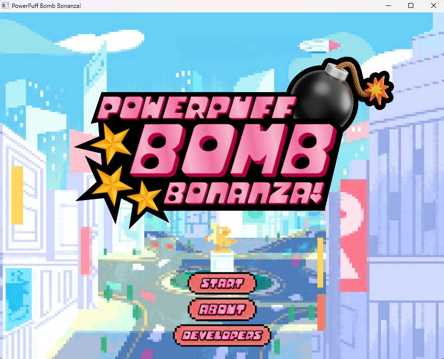

# 💣 Powerpuff Bomb Bonanza

A turn-based strategy game developed in **Java** using **JavaFX**. Inspired by the Powerpuff Girls universe, players engage in explosive battles with bombs, strategy, and chaos!

 <!-- Add your screenshot if available -->

---

## 🎮 Gameplay Overview

In **Powerpuff Bomb Bonanza**, players battle on a grid-based arena, placing bombs, dodging explosions, and using special skills. It's a test of strategy, speed, and timing. The last player standing wins the bonanza!

---

## 🖥️ Requirements

- Java JDK 8 or later
- JavaFX SDK (download from [GluonHQ](https://gluonhq.com/products/javafx/))
- IDE (IntelliJ IDEA, Eclipse, etc.) or terminal/command line

---

## 🚀 How to Run the Game

### 🌀 Clone the Repository

```bash
git clone https://github.com/driee17/powerpuff-bomb-bonanza.git
cd powerpuff-bomb-bonanza
```

### 🧰 Configure JavaFX

* 📦 Download JavaFX SDK and extract it.
* Set your environment variable `PATH_TO_FX` to the path of the `lib` directory inside your JavaFX SDK.
* Example: `export PATH_TO_FX=/path/to/javafx-sdk-XX/lib`

### 🔧 Compile and Run (Command Line)

```
javac --module-path $PATH_TO_FX --add-modules javafx.controls,javafx.fxml -d out src/*.java
java --module-path $PATH_TO_FX --add-modules javafx.controls,javafx.fxml -cp out Main
```

* #### 💡 Using IntelliJ IDEA or Eclipse

  1. Import the project as a Java project.
  2. Add JavaFX SDK as a library.
  3. Set VM options for running: `--module-path /path/to/javafx-sdk/lib --add-modules javafx.controls,javafx.fxml`

###

### 🕹️ How to Play

Each player may choose between the three characters of The
Powerpuff Girls:

**Characters**

* Blossom
* Buttercup
* Bubbles

The players must collect rainbows, within the one-minute timer, in
order to increase their points by 5 to be the winner of the game.

Each player may also attack one another to decrease their health,
below will explain the mechanism and controls thoroughly,

**Mechanism of the attacks**

* Each player can leave bombs within the maze that will
  explode after 2 seconds
* The exploding of the bomb will be in a perpendicular path
* Being hit by the bomb will result to a decrease in health

**Attack controls**

* First player controls: W-A-S-D keys (movements), E key
  (bomb attacks)
* Second player controls: Arrow keys (movements), Enter
  (bomb attacks)

Power-ups and reverse power-ups will randomly spawn across the
maze. The following are the specific power-ups and reverse
power-ups that can be utilized within the duration of the game:

**Power-ups**
● Cupcake increases healthy by 1
● Flower multiplies current points by 2

**Reverse power-ups**
● Mojo Jojo decreases points by 10

A player will lose if their health status becomes 0 or if they fail to
collect the most points throughout the game. Hence, to reiterate, the
winner will have the most points or be the only player left in the
game.

Developers:

* Jewel Colleen Cruz
* Belle Ashley Del Rosario
* Sheri Gastardo
* Adrian Cueto
